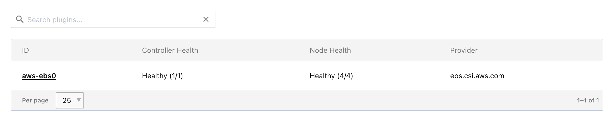
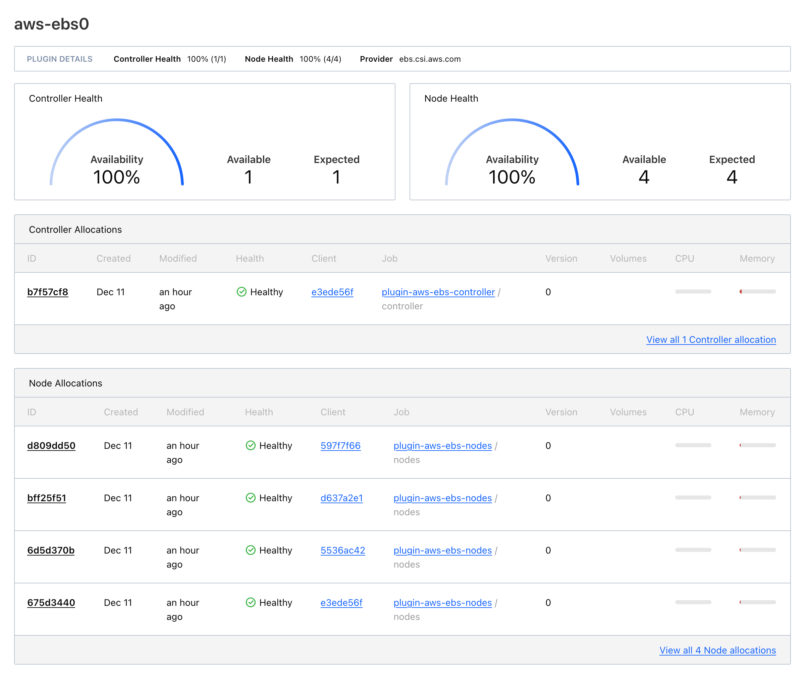
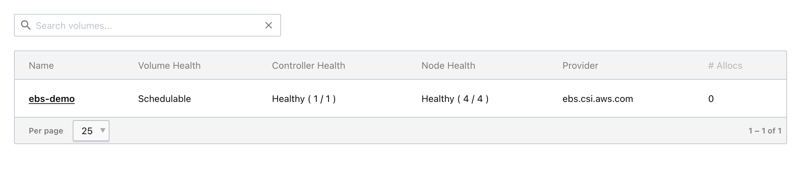

# aws-ebs-csi-plugin

Howdy! 

Thanks for stopping by. Couple of prerequisites to run this, but should be straight-forward. Steps are below to walk you through this simple process. 

This demo will create a volume, create jobspecs to deploy the AWS EBS CSI Plugin on your Nomad cluster, and register the EBS volume with the cluster. 

The AWS CSI Driver image is maintained by Amazon and can be found here : 

https://gallery.ecr.aws/ebs-csi-driver/aws-ebs-csi-driver 

For this demo, `public.ecr.aws/ebs-csi-driver/aws-ebs-csi-driver:v1.38.1` was used. 

## Prerequisites

- AWS Account
- Nomad Cluster
  - Instances have an IAM Profile attached
- Client nodes with [Docker](https://developer.hashicorp.com/nomad/docs/drivers/docker) with `allow_privileged` [configured](https://developer.hashicorp.com/nomad/docs/drivers/docker#allow_privileged). 

## Steps

### Update variable file

1. Update the tfvars file. 

`cp csi.auto.tfvars.example csi.auto.tfvars`

Update `aws_region` to the region hosting your instances. 
Update `aws_availability_zone` with the availability zone to provision the ebs volume. 

If your existing iam role does not allow the following actions by the ec2 instance:  

```
actions = [
      "ec2:DescribeInstances",
      "ec2:DescribeTags",
      "ec2:DescribeVolumes",
      "ec2:AttachVolume",
      "ec2:DetachVolume",
    ]
```

Set `add_iam_mount_policy` to true and update `aws_iam_role` with the correct role. 

2. Run terraform. 

`terraform init`
`terraform apply`

Review the proposed changes. 
Depending on if the IAM policy is being added, you will see the following:

aws_ebs_volume.aws_ebs_csi_demo -> ebs volume which will be later mounted. 

The following are files which are created inside a new folder called `storage`. 
local_file.controller -> creates a jobspec to deploy the csi controller. 
local_file.nodes -> creates a system jobspec to deploy to the nodes. 
local_file.volume_registration -> creates the necessary volume registration configuration. 

3. CSI Setup

After the apply is run, a newly created volume now exists in your aws region. 

The nomad jobspec files have been created, as well. 

```
storage
├── job
│   ├── plugin-ebs-controller.nomad.hcl
│   └── plugin-ebs-nodes.nomad.hcl
└── volume
    └── ebs-volume.nomad.hcl

3 directories, 3 files
```


>Note: 
When viewing jobspecs for the controller and nodes, there is a unique `csi_plugin` block. For further information on this please review: [csi_plugin](https://developer.hashicorp.com/nomad/docs/job-specification/csi_plugin).

When ready, follow the commands from your terraform output. 

```
Outputs:

nomad = <<EOT
  Following commands need to be run to deploy the CSI driver and register the EBS volume:

Run the controller job:
  nomad job run ./storage/job/plugin-ebs-controller.nomad.hcl

Run the node job:
  nomad job run ./storage/job/plugin-ebs-nodes.nomad.hcl

Register the volume:
  nomad volume register ./storage/volume/ebs-volume.nomad.hcl

Check Status:
  nomad job status plugin-aws-ebs-controller  

EOT
```

Confirm the jobs are running either by `nomad status`, in the nomad ui, or if successfully deployed by `nomad plugin status`: 

```
Container Storage Interface
ID        Provider         Controllers Healthy/Expected  Nodes Healthy/Expected
aws-ebs0  ebs.csi.aws.com  1/1                           4/4
``` 

From the UI: 



From the UI, you can navigate deeper for a great view on current status. 



Last item will be to register the volume.

```
nomad volume register ./storage/volume/ebs-volume.nomad.hcl

Volume "ebs-demo" registered
```

You can check the status of all volumes by the following: 

```
nomad volume status
Container Storage Interface
ID        Name      Namespace  Plugin ID  Schedulable  Access Mode
ebs-demo  ebs-demo  default    aws-ebs0   true         <none>
```

Or from the UI: 



4. Using the volume

CSI Plugin has been successfully added, and the volume is now registered. 

When ready to consume this volume, add the `volume` and `volume_mount` configuration to your jobspec. 

Volume:  
https://developer.hashicorp.com/nomad/docs/job-specification/volume  

Volume Mount:  
https://developer.hashicorp.com/nomad/docs/job-specification/volume_mount 

5. Cleanup

To clean up anything done here, run the following in order. 

Deregister Volume

```
nomad volume deregister ebs-demo
```

Nomad Jobs  

```
nomad job stop -purge plugin-aws-ebs-nodes 
nomad job stop -purge plugin-aws-ebs-controller
```

Terraform Resources

```
terraform destroy
```


<!-- BEGIN_TF_DOCS -->
## Requirements

The following requirements are needed by this module:

- <a name="requirement_terraform"></a> [terraform](#requirement\_terraform) (>= 1.9)

- <a name="requirement_aws"></a> [aws](#requirement\_aws) (~> 5.0)

- <a name="requirement_local"></a> [local](#requirement\_local) (~> 2.0)

## Providers

The following providers are used by this module:

- <a name="provider_aws"></a> [aws](#provider\_aws) (5.80.0)

- <a name="provider_local"></a> [local](#provider\_local) (2.5.2)

## Modules

No modules.

## Resources

The following resources are used by this module:

- [aws_ebs_volume.aws_ebs_csi_demo](https://registry.terraform.io/providers/hashicorp/aws/latest/docs/resources/ebs_volume) (resource)
- [aws_iam_role_policy.mount_ebs_volumes](https://registry.terraform.io/providers/hashicorp/aws/latest/docs/resources/iam_role_policy) (resource)
- [local_file.controller](https://registry.terraform.io/providers/hashicorp/local/latest/docs/resources/file) (resource)
- [local_file.nodes](https://registry.terraform.io/providers/hashicorp/local/latest/docs/resources/file) (resource)
- [local_file.volume_registration](https://registry.terraform.io/providers/hashicorp/local/latest/docs/resources/file) (resource)
- [aws_iam_policy_document.mount_ebs_volumes](https://registry.terraform.io/providers/hashicorp/aws/latest/docs/data-sources/iam_policy_document) (data source)
- [aws_iam_role.nomad](https://registry.terraform.io/providers/hashicorp/aws/latest/docs/data-sources/iam_role) (data source)

## Required Inputs

The following input variables are required:

### <a name="input_aws_iam_role"></a> [aws\_iam\_role](#input\_aws\_iam\_role)

Description: IAM role for Nomad to add the IAM policy to mount EBS volumes.

Type: `string`

## Optional Inputs

The following input variables are optional (have default values):

### <a name="input_add_iam_mount_policy"></a> [add\_iam\_mount\_policy](#input\_add\_iam\_mount\_policy)

Description:   Toggling will add an IAM policy to an existing IAM role for Nomad to mount EBS volumes.  
  add\_iam\_mount\_policy = true will also require the aws\_iam\_role variable to be set to an existing IAM role for Nomad.

Type: `bool`

Default: `false`

### <a name="input_aws_availability_zone"></a> [aws\_availability\_zone](#input\_aws\_availability\_zone)

Description: Availability zone of Nomad Cluster, e.g. us-east-2a.

Type: `string`

Default: `"us-east-2a"`

### <a name="input_aws_region"></a> [aws\_region](#input\_aws\_region)

Description: AWS region of Nomad Cluster, e.g. us-east-2.

Type: `string`

Default: `"us-east-2"`

### <a name="input_name"></a> [name](#input\_name)

Description: Name of the Nomad related resources.

Type: `string`

Default: `"aws-ebs-csi"`

## Outputs

The following outputs are exported:

### <a name="output_nomad"></a> [nomad](#output\_nomad)

Description: n/a
<!-- END_TF_DOCS -->